<div align="center">



<br />
<br />


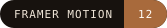
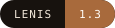

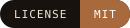

<br />
<br />

<a href="#installation"></a>
&nbsp;
<a href="https://www.figma.com/design/rB8iNTVSekK73jEf5ASRYR/Untitled?node-id=0-1"></a>
&nbsp;
<a href="https://github.com/Samudra-GITHub"></a>
&nbsp;
<a href="https://github.com/Samudra-GITHub/noir-cafe"></a>

<sub>The public deploy link lands with Phase 10 — until then, the live demo runs locally in two commands.</sub>

</div>

<br />

<p align="center"></p>

## ☕ Cinematic preview

<p align="center">
  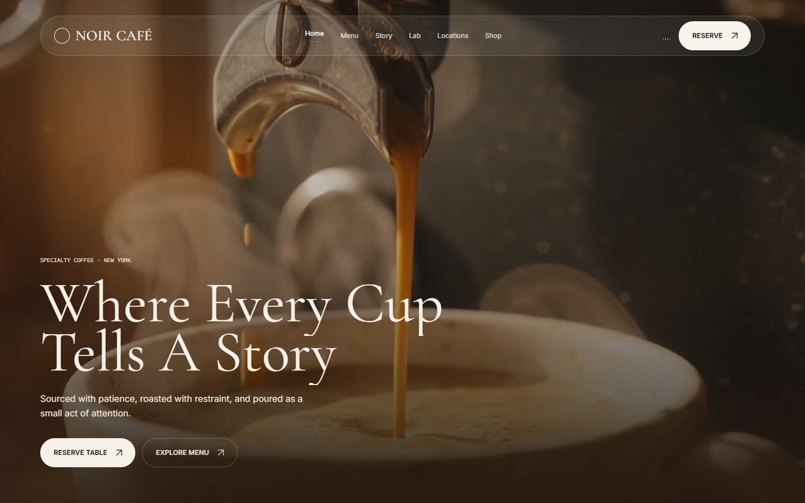
  <br />
  <sub><b>Homepage hero.</b> A sticky espresso film, masked headline reveal, steam, grain and warm glass navigation.</sub>
</p>

<table>
  <tr>
    <td width="50%" valign="top">
      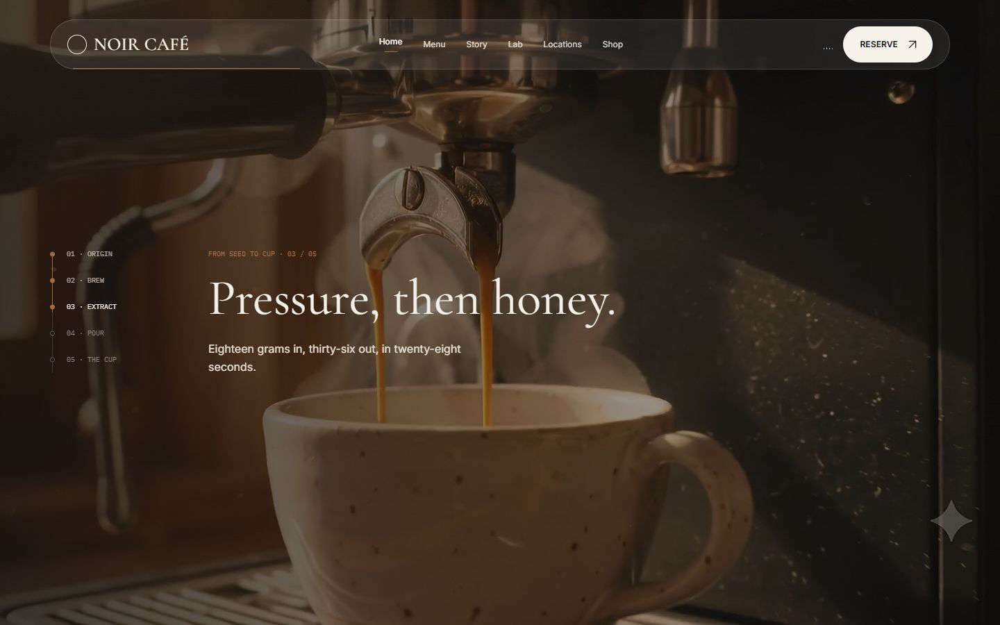
      <br /><sub><b>Scroll story.</b> Origin → Brew → Extract → Pour → The cup, driven by scroll.</sub>
    </td>
    <td width="50%" valign="top">
      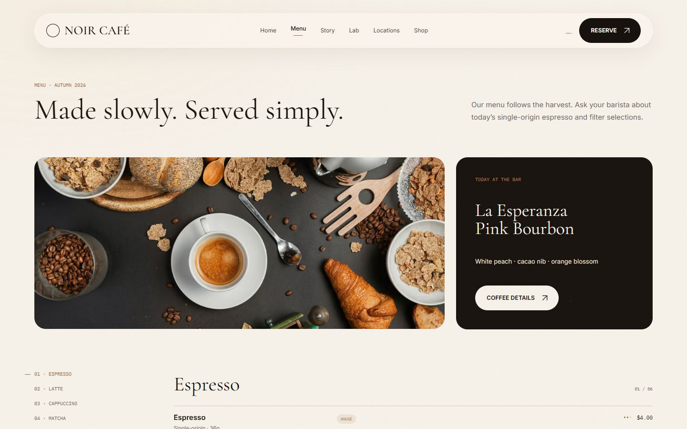
      <br /><sub><b>Menu.</b> Sticky scrollspy index, roast meters and flavor notes.</sub>
    </td>
  </tr>
  <tr>
    <td width="50%" valign="top">
      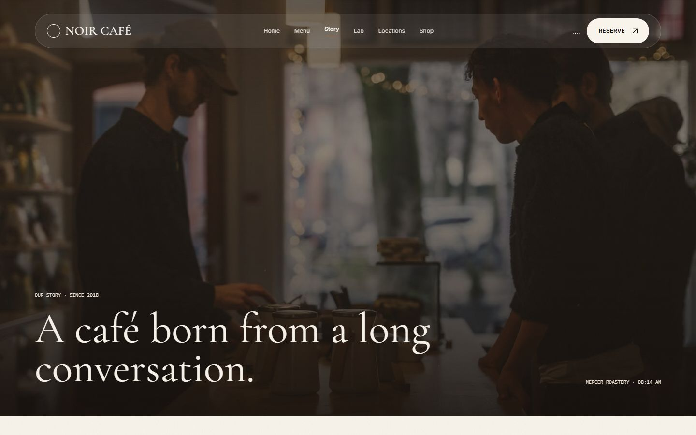
      <br /><sub><b>Story.</b> Full-bleed editorial photography with parallax.</sub>
    </td>
    <td width="50%" valign="top">
      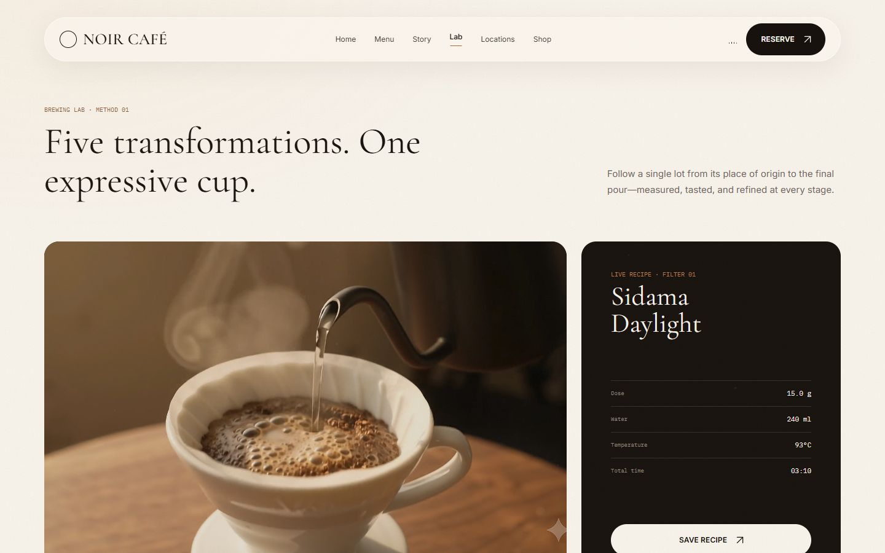
      <br /><sub><b>Brewing Lab.</b> Pour-over film beside a live recipe card.</sub>
    </td>
  </tr>
  <tr>
    <td width="50%" valign="top">
      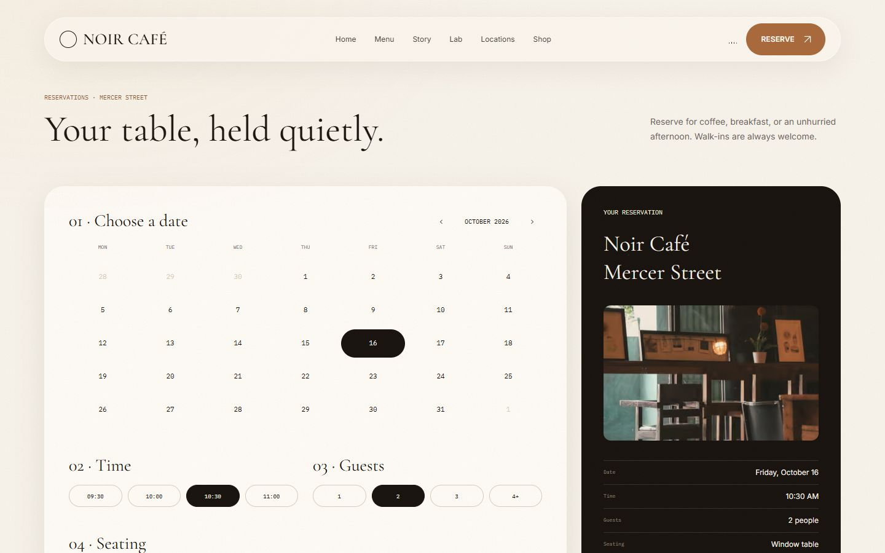
      <br /><sub><b>Reservation.</b> Keyboard calendar and a live summary.</sub>
    </td>
    <td width="50%" valign="top">
      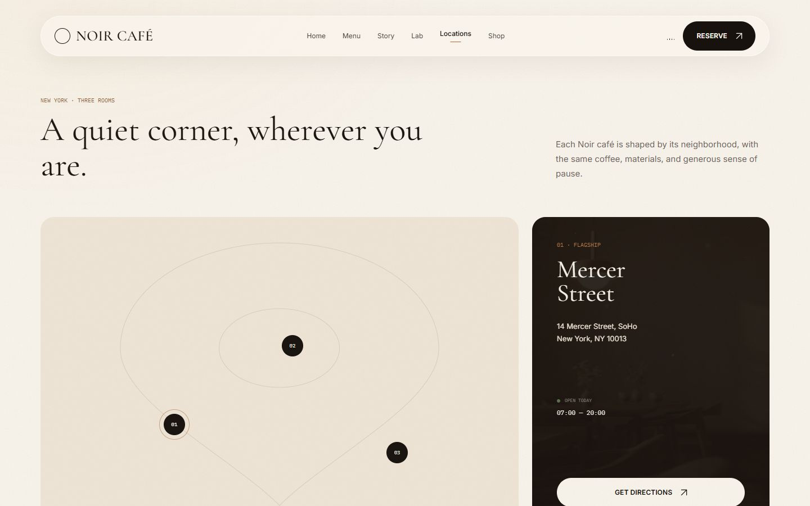
      <br /><sub><b>Locations.</b> Illustrated map with coffee-bean markers.</sub>
    </td>
  </tr>
  <tr>
    <td width="50%" valign="top">
      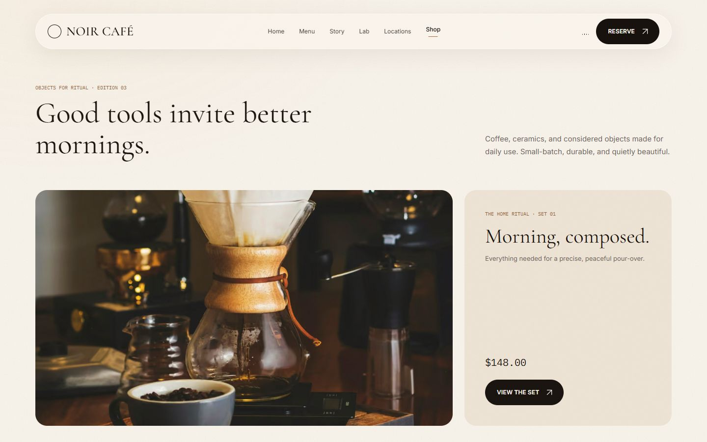
      <br /><sub><b>Shop.</b> Editorial storefront with quick view.</sub>
    </td>
    <td width="50%" valign="top">
      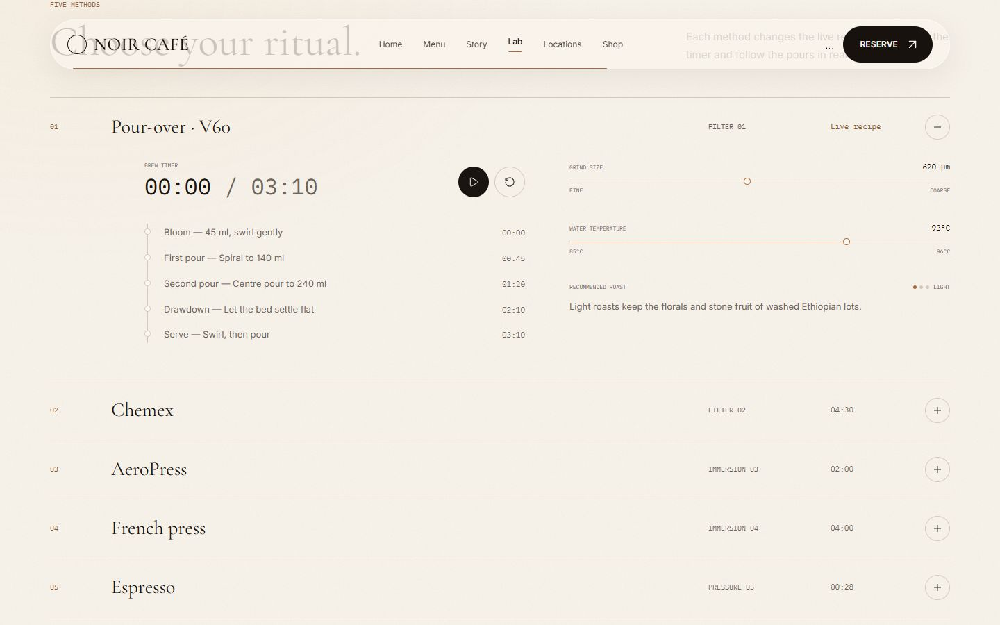
      <br /><sub><b>Brew guide.</b> Five methods, a live timer and grind and temperature scales.</sub>
    </td>
  </tr>
</table>

<p align="center"></p>

## Philosophy

<p align="center">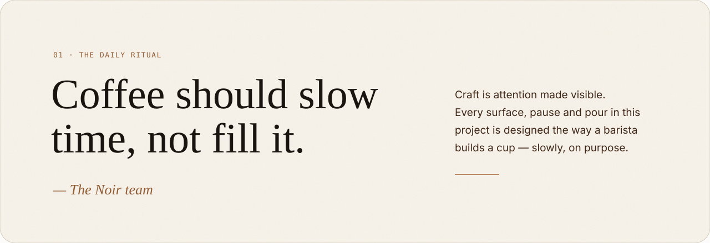</p>

> **Craftsmanship.** Every surface was traced from Figma exports and diffed against them in a headless browser, section by section, until the numbers matched.
>
> **Coffee as ritual.** The site moves at the pace of a pour-over: nothing snaps, nothing shouts. Motion confirms hierarchy, never delays content.
>
> **Design meets engineering.** Tokens, primitives and variants — not one-off styles — so the tenth page is as considered as the first.

<p align="center"></p>

## Design system

<p align="center">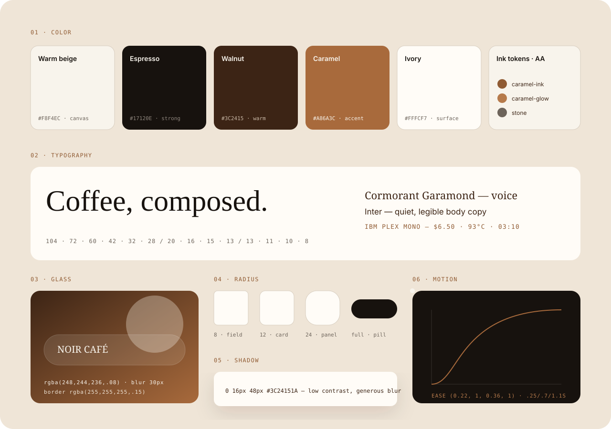</p>

<table>
  <tr>
    <th align="left">Token</th>
    <th align="left">Value</th>
    <th align="left">Where it lives</th>
  </tr>
  <tr><td>Color</td><td><code>#F8F4EC</code> · <code>#17120E</code> · <code>#3C2415</code> · <code>#A86A3C</code> · <code>#EFE5D7</code></td><td><code>src/styles/tokens.css</code></td></tr>
  <tr><td>Accessible ink</td><td><code>caramel-ink #905B33</code> · <code>caramel-glow #B67A4B</code> · <code>stone #6D645B</code></td><td>AA on every surface</td></tr>
  <tr><td>Typography</td><td>Cormorant Garamond · Inter · IBM Plex Mono — 104 → 8 px</td><td><code>@theme</code> in <code>globals.css</code></td></tr>
  <tr><td>Glass</td><td><code>rgba(248,244,236,.08)</code> · blur 30px · <code>rgba(255,255,255,.15)</code></td><td><code>glass</code> / <code>glass-cream</code> utilities</td></tr>
  <tr><td>Radius</td><td>8 · 12 · 20 · 24 · 32 · full</td><td><code>--radius-*</code></td></tr>
  <tr><td>Shadow</td><td><code>0 16px 48px #3C24151A</code></td><td><code>shadow-card</code></td></tr>
  <tr><td>Motion</td><td><code>cubic-bezier(0.22, 1, 0.36, 1)</code> · .25 / .7 / 1.1 s</td><td><code>src/lib/motion.ts</code></td></tr>
</table>

<p align="center"></p>

## Tech stack

<p align="center">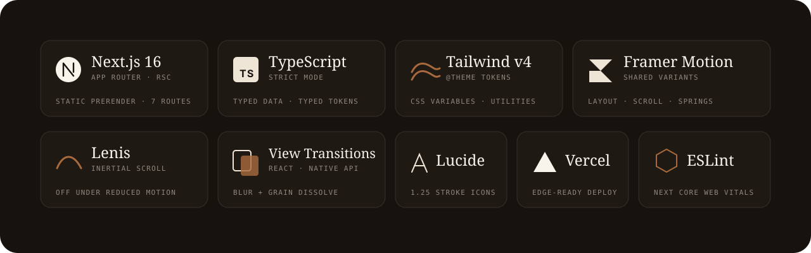</p>

<p align="center"></p>

## Motion features

<p align="center">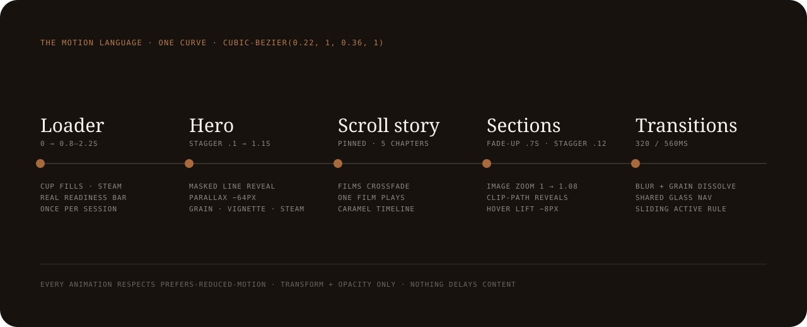</p>

<table>
  <tr><th align="left">Feature</th><th align="left">What it does</th><th align="left">Detail</th></tr>
  <tr><td><b>Sticky hero</b></td><td>The espresso film pins while the page rises over it</td><td>Parallax −64px · scale scrub 1.04 → 1.1</td></tr>
  <tr><td><b>Steam</b></td><td>Blurred wisps drift up from the cup</td><td>CSS only · ≤ 8% opacity</td></tr>
  <tr><td><b>Glass navigation</b></td><td>Warm frost over film, cream glass over paper</td><td>Sliding active rule · reading progress · focus-trapped sheet</td></tr>
  <tr><td><b>Parallax</b></td><td>Photography drifts slower than the page</td><td>Clip-path reveal · 1.12 → 1 settle</td></tr>
  <tr><td><b>Scroll story</b></td><td>Five chapters of preparation, one film at a time</td><td>Pinned · caramel timeline</td></tr>
  <tr><td><b>Cursor</b></td><td>A coffee bean with link, view and progress states</td><td>Fine pointers only · lazy-loaded</td></tr>
  <tr><td><b>Transitions</b></td><td>Routes dissolve through blur and grain</td><td>React <code>&lt;ViewTransition&gt;</code> · nav as a shared element</td></tr>
  <tr><td><b>Loader</b></td><td>"Preparing your coffee…" — the cup fills</td><td>Real readiness · once per session · <code>SHOW_LOADER</code> switch</td></tr>
  <tr><td><b>Newsletter</b></td><td>Floating label, shake on error, drawn check on success</td><td>Server action · value kept on error</td></tr>
  <tr><td><b>Carousel</b></td><td>Drag with inertia and a slight 3D tilt</td><td>Spring 120 / 20 · pausable progress line</td></tr>
</table>

<sub>Every animation respects <code>prefers-reduced-motion</code>: the loader, cursor, Lenis, transitions and video all stand down.</sub>

<p align="center"></p>

## Pages

<table>
  <tr>
    <td width="44%" valign="top">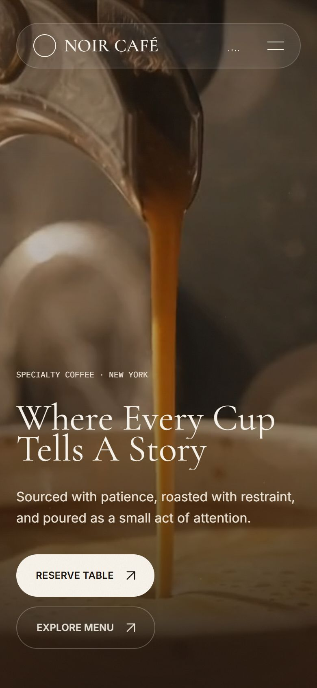 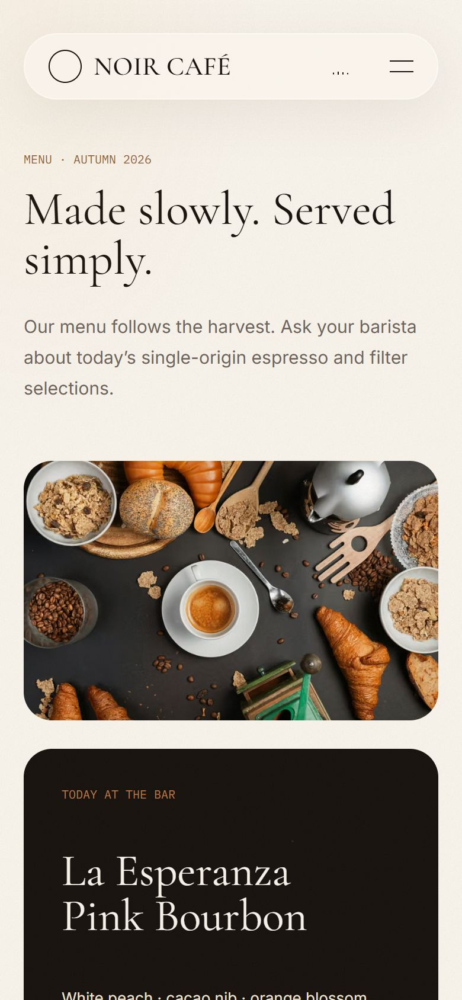</td>
    <td valign="top">
      <h3>Home &nbsp;·&nbsp; Menu</h3>
      <p>A sticky cinematic hero, then a scroll-driven preparation story, featured drinks, the most-loved carousel, story and lab previews, and the visit / shop split. The menu pairs a <em>Today at the bar</em> panel with six categories behind a scrollspy index; on phones they fold into an accordion.</p>
      <p><sub><b>Features</b> — roast meters · flavor chips · drag carousel · newsletter<br /><b>Motion</b> — masked line reveal · parallax · hover lift · sliding index rule</sub></p>
    </td>
  </tr>
  <tr>
    <td width="44%" valign="top">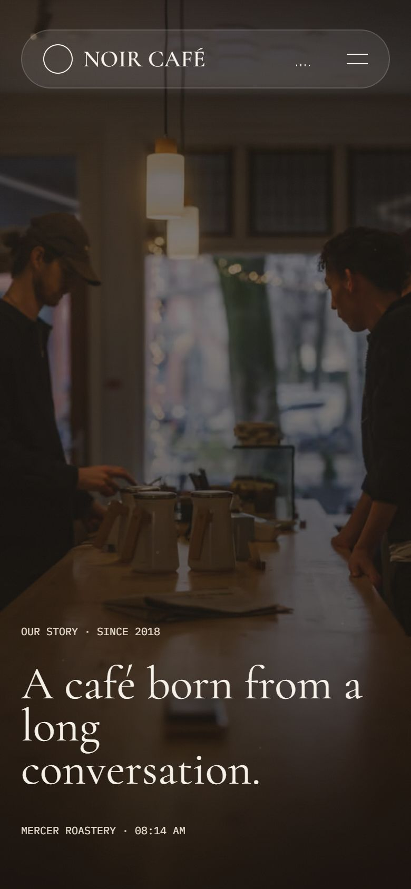 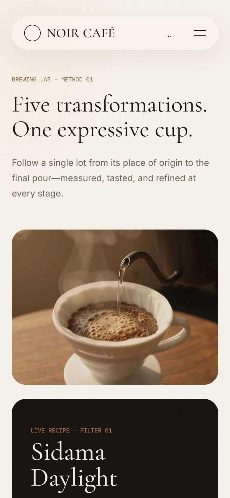</td>
    <td valign="top">
      <h3>Story &nbsp;·&nbsp; Brewing Lab</h3>
      <p>A magazine layout — pull quote, two columns, photographs uncovered on scroll, the values that stay constant, and a founding timeline over the ambience film. The lab pairs the pour-over film with a live recipe card, five transformation cards, and five brewing methods that expand into timers and scales.</p>
      <p><sub><b>Features</b> — timeline · brew timer · grind &amp; temperature indicators · saved recipes<br /><b>Motion</b> — clip reveals · recipe crossfades · stage progress</sub></p>
    </td>
  </tr>
  <tr>
    <td width="44%" valign="top">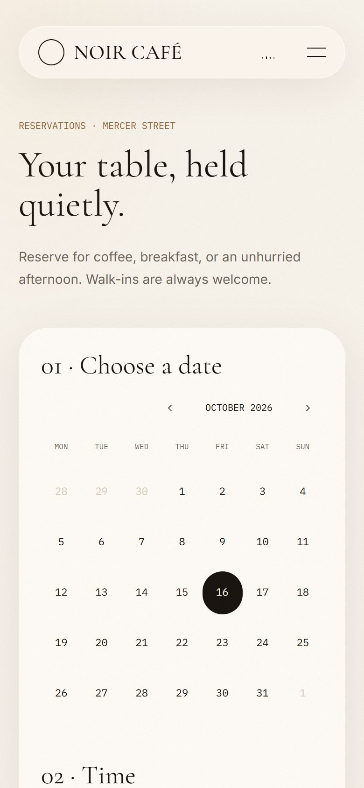 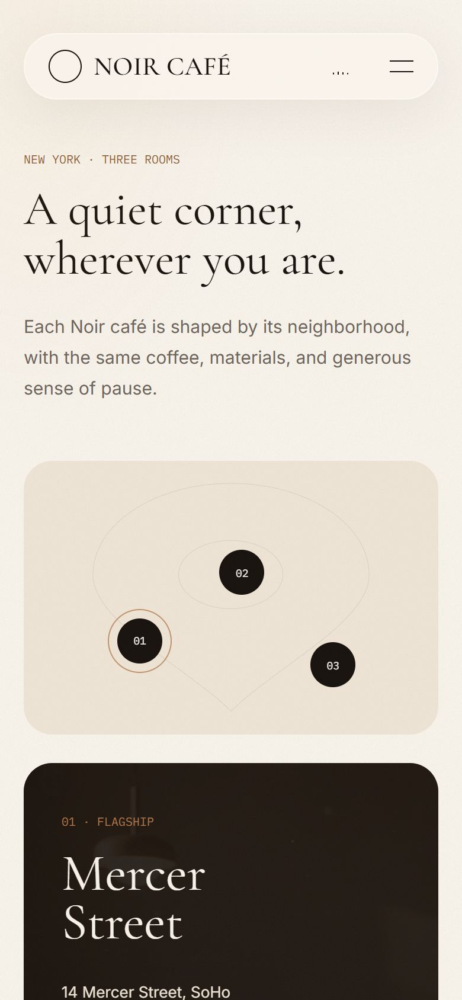</td>
    <td valign="top">
      <h3>Reservation &nbsp;·&nbsp; Locations</h3>
      <p>A calendar you can drive entirely from the keyboard, time and guest pickers, window / indoor / outdoor seating and validated details beside a live summary. Locations sets an illustrated map against the flagship panel, with open-now status computed in New York time.</p>
      <p><sub><b>Features</b> — roving-focus calendar · validation · bean map markers · directions<br /><b>Motion</b> — gliding day pill · animated focus · ambient film behind the flagship</sub></p>
    </td>
  </tr>
  <tr>
    <td width="44%" valign="top">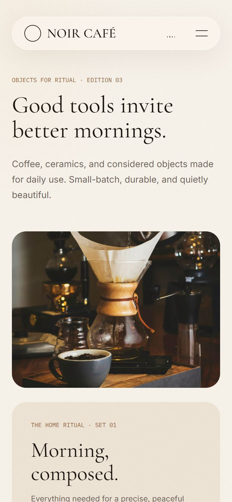</td>
    <td valign="top">
      <h3>Shop</h3>
      <p>An editorial storefront: the home-ritual set, category filters and six objects. Each opens a quick view with roast chips, variant and quantity selectors and a sticky information column. Checkout is intentionally out of scope.</p>
      <p><sub><b>Features</b> — quick view dialog · variants · quantity · local bag<br /><b>Motion</b> — hover zoom · filter reflow · focus-trapped dialog</sub></p>
    </td>
  </tr>
</table>

<p align="center"></p>

## Architecture

<p align="center">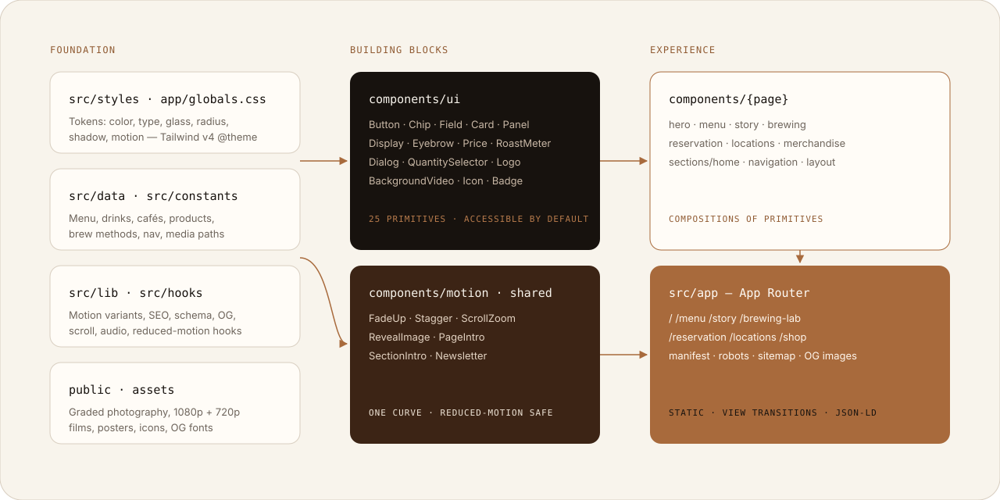</p>

```text
noir-cafe/
├── assets/                 # OG fonts, OG backdrops, README artwork
├── design/                 # Figma exports — the source of truth
├── public/
│   ├── images/             # Graded editorial photography
│   ├── videos/             # 1080p + 720p films, WebP posters
│   ├── icons/              # PWA icons
│   └── og/                 # Social preview
└── src/
    ├── app/                # Routes, metadata, manifest, robots, sitemap, OG images
    ├── components/
    │   ├── ui/             # 25 accessible primitives
    │   ├── motion/         # FadeUp, Stagger, ScrollZoom, RevealImage
    │   ├── shared/         # PageIntro, SectionIntro, Newsletter
    │   ├── layout/         # Loader, transitions, cursor, footer, atmosphere
    │   ├── navigation/     # Glass nav, sound toggle
    │   ├── hero/           # Home hero, scroll story, steam, grain
    │   ├── sections/home/  # Homepage compositions
    │   ├── menu/ story/ brewing/ reservation/ locations/ merchandise/
    │   └── seo/            # JSON-LD
    ├── constants/          # Site, navigation, media
    ├── data/               # Menu, drinks, cafés, products, brew methods
    ├── hooks/              # Motion-safe, scroll, spy, audio, bag, open-now
    ├── lib/                # Motion variants, SEO, schema, OG renderer
    └── styles/             # Design tokens
```

<p align="center"></p>

## Performance

<p align="center">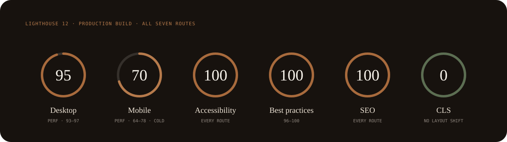</p>

<table>
  <tr><th align="left">Area</th><th align="left">Result</th></tr>
  <tr><td>Desktop performance</td><td>93–97 across all seven routes</td></tr>
  <tr><td>Mobile performance</td><td>64–78 on a cold first visit — the loader text becomes the LCP element; set <code>SHOW_LOADER = false</code> to trade it for speed</td></tr>
  <tr><td>Accessibility · SEO</td><td>100 · 100 on every route</td></tr>
  <tr><td>CLS</td><td>0 everywhere</td></tr>
  <tr><td>Bundle</td><td>~216 KB gz shared (React, Next, Motion) · 6–11 KB gz per route · cursor split out</td></tr>
  <tr><td>Images</td><td>AVIF / WebP · responsive sizes · three quality tiers · a year of immutable caching</td></tr>
  <tr><td>Video</td><td>Faststart H.264 · 720p on phones · posters · lazy sources · paused off screen · Save-Data aware</td></tr>
</table>

<p align="center"></p>

## Accessibility

- **Keyboard.** Every control is reachable. The calendar supports arrows, Home / End and Page Up / Down. The mobile menu and quick view trap focus and close on <kbd>Esc</kbd>, returning focus to their trigger.
- **Reduced motion.** Honored everywhere: no loader, cursor, Lenis, transitions or autoplaying film.
- **Focus states.** A caramel ring that reads on paper and on espresso.
- **ARIA.** Live regions for the carousel, recipe card, timer, summary and filters; pressed, expanded and current states throughout.
- **Contrast.** AA for all text via dedicated ink tokens.
- **Semantic HTML.** Landmarks, a single `h1` per page, real lists, `dl` for specs, `address` for cafés, a skip link.

## SEO & PWA

<table>
  <tr><td><b>Manifest</b></td><td><code>/manifest.webmanifest</code> — standalone, espresso theme, shortcuts</td></tr>
  <tr><td><b>Structured data</b></td><td>Organization · 3 × CafeOrCoffeeShop with hours · Menu with prices · Product list</td></tr>
  <tr><td><b>Open Graph</b></td><td>A branded 1200 × 630 card per route, rendered at build</td></tr>
  <tr><td><b>Twitter cards</b></td><td><code>summary_large_image</code> on every route</td></tr>
  <tr><td><b>Robots · Sitemap</b></td><td><code>/robots.txt</code> · <code>/sitemap.xml</code></td></tr>
  <tr><td><b>Icons</b></td><td>SVG favicon · Apple touch icon · 192 / 512 / maskable</td></tr>
</table>

<p align="center"></p>

## Project timeline

| Phase | Chapter | Status |
| :-- | :-- | :-- |
| 01 | Design system extraction & tokens | ● Complete |
| 02 | Homepage, pixel-matched to Figma | ● Complete |
| 2.5 | Cinematic polish — glass, grain, micro-interactions | ● Complete |
| 03 | Menu | ● Complete |
| 04 | Our Story | ● Complete |
| 05 | Brewing Lab | ● Complete |
| 06 | Reservation | ● Complete |
| 07 | Locations | ● Complete |
| 08 | Shop | ● Complete |
| 09 | Master polish — loader, transitions, audio, cursor, SEO, PWA | ● Complete |
| 10 | Deploy · booking & email services · checkout · CMS | ○ Next |

## Installation

```bash
git clone https://github.com/Samudra-GITHub/noir-cafe.git
cd noir-cafe
```

```bash
npm install
```

```bash
npm run dev
```

```bash
npm run typecheck && npm run lint && npm run build
```

Deploy to Vercel (set `NEXT_PUBLIC_SITE_URL` to your domain so Open Graph, canonical URLs and the sitemap resolve):

```bash
npx vercel --prod
```

<p align="center"></p>

## Gallery

<table>
  <tr>
    <td></td>
    <td></td>
    <td></td>
    <td></td>
  </tr>
  <tr>
    <td></td>
    <td></td>
    <td></td>
    <td>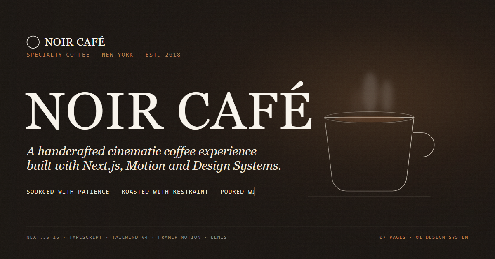</td>
  </tr>
</table>

## Credits

- **Photography** — [Unsplash](https://unsplash.com) contributors, used under the Unsplash License and graded into one warm, filmic language.
- **Film** — ambient coffee clips supplied for the project.
- **Motion inspiration** — the pace of a pour-over; editorial scroll storytelling from Awwwards-recognised studios.
- **Design inspiration** — Aesop retail, specialty roaster packaging, and printed coffee menus.
- **Type** — Cormorant Garamond, Inter and IBM Plex Mono, via Google Fonts (SIL Open Font License).

See also: [Project overview](PROJECT_OVERVIEW.md) · [Changelog](CHANGELOG.md) · [Contributing](CONTRIBUTING.md) · [Security](SECURITY.md) · [Code of conduct](CODE_OF_CONDUCT.md) · [License](LICENSE)

<br />

<p align="center">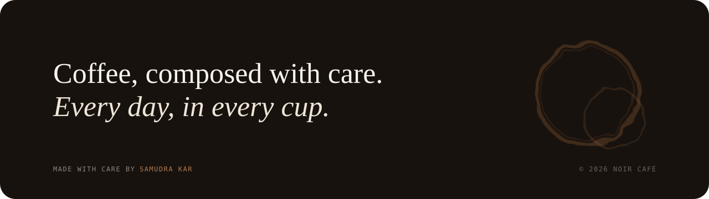</p>
